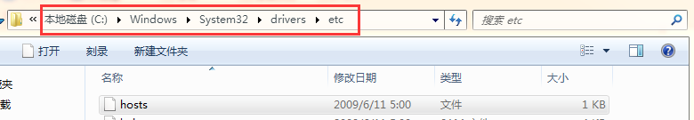
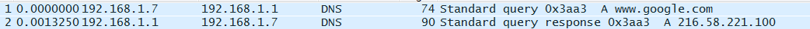
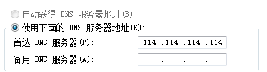
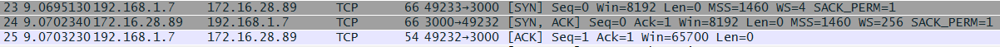
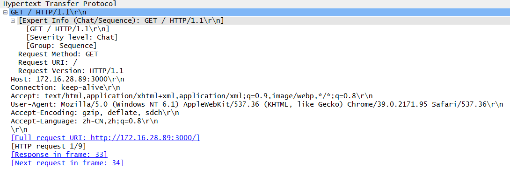
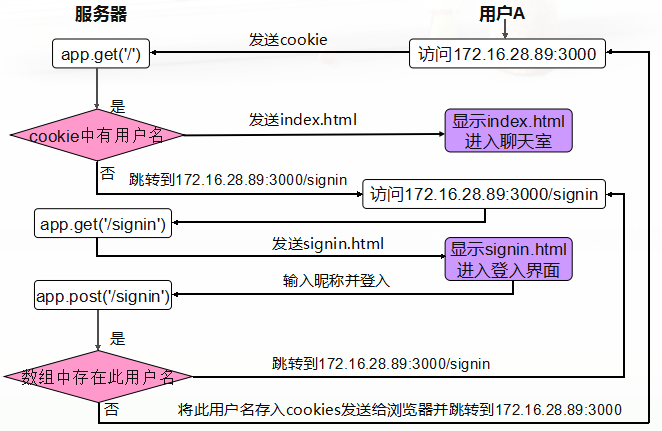
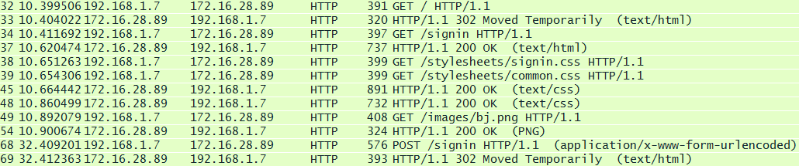
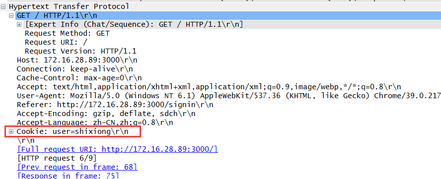
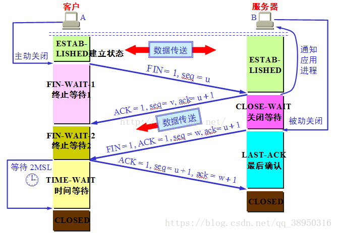

HTTP简介
====
HTTP协议是Hyper Text Transfer Protocol（**超文本传输协议**）的缩写,是用于从万维网（WWW:World Wide Web ）服务器传输超文本到本地浏览器的传送协议。

HTTP是一个基于TCP/IP通信协议来传递数据（HTML 文件, 图片文件, 查询结果等）。

HTTP是一个属于应用层的面向对象的协议，由于其简捷、快速的方式，适用于分布式超媒体信息系统。它于1990年提出，经过几年的使用与发展，得到不断地完善和扩展。目前在WWW中使用的是HTTP/1.0的第六版，HTTP/1.1的规范化工作正在进行之中，而且HTTP-NG(Next Generation of HTTP)的建议已经提出。

HTTP协议**工作于客户端-服务端架构为上**。浏览器作为HTTP客户端通过URL向HTTP服务端即WEB服务器发送所有请求。Web服务器根据接收到的请求后，向客户端发送响应信息。


特点
---

1. 简单快速：客户向服务器请求服务时，只需传送请求方法和路径。请求方法常用的有GET、HEAD、POST。每种方法规定了客户与服务器联系的类型不同。由于HTTP协议简单，使得HTTP服务器的程序规模小，因而通信速度很快。

2. 灵活：HTTP允许传输任意类型的数据对象。正在传输的类型由Content-Type加以标记。

3. 无连接：无连接的含义是限制每次连接只处理一个请求。服务器处理完客户的请求，并收到客户的应答后，即断开连接。采用这种方式可以节省传输时间。

4. 无状态：HTTP协议是无状态协议。无状态是指协议对于事务处理没有记忆能力。缺少状态意味着如果后续处理需要前面的信息，则它必须重传，这样可能导致每次连接传送的数据量增大。另一方面，在服务器不需要先前信息时它的应答就较快。
5. 支持B/S及C/S模式。


工作流程
---
一次HTTP操作称为一个事务，其工作过程可分为四步：

1. 首先客户机与服务器需要建立连接。只要单击某个超级链接，HTTP的工作开始。

2. 建立连接后，客户机发送一个请求给服务器，请求方式的格式为：统一资源标识符（URL）、协议版本号，后边是MIME信息包括请求修饰符、客户机信息和可能的内容。

3. 服务器接到请求后，给予相应的响应信息，其格式为一个状态行，包括信息的协议版本号、一个成功或错误的代码，后边是MIME信息包括服务器信息、实体信息和可能的内容。

4. 客户端接收服务器所返回的信息通过浏览器显示在用户的显示屏上，然后客户机与服务器断开连接。

如果在以上过程中的某一步出现错误，那么产生错误的信息将返回到客户端，有显示屏输出。对于用户来说，这些过程是由HTTP自己完成的，用户只要用鼠标点击，等待信息显示就可以了。

客户端浏览器与服务器的交互过程
---
* 查找到URL所在的服务器地址
  * 如果URL的地址是一个域名，不是IP地址，则通过DNS(Domain Name System，域名系统)将域名解析成IP地址。步骤如下:
    * 浏览器缓存。如果存在，则解析过程结束；

    * 系统缓存。如果浏览器未缓存，浏览器会检查操作系统缓存中是否有这个这个域名对应的ip地址。windows系统中缓存路径及文件部分内容如下：


    
    * 路由器缓存。若本机中没有解析到，则将请求发送给路由器。wireshark抓包截图如下：
    
    * DNS提供商缓存。若仍未解析到，则检查TCP/IP中设置的DNS服务器，将URL发送给DNS服务器，最终返回域名的Ip地址。windows下DNS服务器设置界面如下:
    
    我是直接输入的服务器ip地址(172.16.28.89:3000)，故不需DNS解析。
  * 如果URL中不包括端口号，则使用协议的默认端口号。如http协议的默认端口号为80。我在服务器端设置的监听端口为3000，故浏览器访问时输入对应端口。
* TCP三次握手，建立连接  

  http应用层协议是建立在TCP传输层协议之上的。在浏览器发送http请求之前，会先通过三次握手建立TCP连接，提供可靠传输。

  
* 浏览器根据http规范，产生请求数据包

  

    http定义了与服务器交互的不同方法，最基本的方法有4种，分别是GET，POST，PUT，DELETE。

    其中最重要的两种方法：GET是向服务器发索取数据的一种请求，而POST是向服务器提交数据的一种请求。

    抓包显示，第一次访问服务器为GET请求，本地并未保存任何cookies信息，故http请求头部中并未包含任何cookie信息。

    关于http协议的具体细节后续再深入研究。
* 服务器与客户端交互   

    

1. 服务器端响应： app.get('/'function (req, res) {}， 检查请求消息中是否含有cookies信息，没有则让用户重定向到/signin；

2. 客户端再次通过URL(http://172.16.28.89:3000/signin)像服务器发送GET请求；

3. 服务器端响应：app.get('/signin', function (req, res) {}，向客户端发送signin.html文档；

4. 文档中包含CSS式样、图片资源，故客户端再次像服务器发起请求；

5. 服务器返回请求的资源；

6. 客户端显示注册登入页面，输入用户名后点击登入。通过POST方法像服务器提交数据请求；

7. 服务器端响应:app.post('/signin', function (req, res) {}，检查POST请求中的用户名，若已经存在即该用户名已注册，则让用户重定向到/signin，再次输入用户名注册登入；若用户名不存在，则服务器通过Set-Cookie将用户名存入Cookies并发送给浏览器，同时重定向到172.16.28.89:3000。

    

8. 客户端收到消息后，将Cookie存入本地，此后客户端通过URL(http://172.16.28.89:3000)向服务器发送请求时，请求中都会自动包含这个Cookie。

    

9. 重复第一步，服务器判断请求消息中是否包含Cookies信息，有则返回index.html文档。至此结束。
HTTP之URL
---

HTTP使用统一资源标识符（Uniform Resource Identifiers, URI）来传输数据和建立连接。

URL是一种特殊类型的URI，包含了用于查找某个资源的足够的信息。URL,全称是UniformResourceLocator, 中文叫统一资源定位符,是互联网上用来标识某一处资源的地址。

完整的URL包括以下几部分：

1. 协议部分：该URL的协议部分为“http：”，这代表网页使用的是HTTP协议。在Internet中可以使用多种协议，如HTTP，FTP等等本例中使用的是HTTP协议。在"HTTP"后面的“//”为分隔符

2. 域名部分：该URL的域名部分为“www.aspxfans.com”。一个URL中，也可以使用IP地址作为域名使用

3. 端口部分：跟在域名后面的是端口，域名和端口之间使用“:”作为分隔符。端口不是一个URL必须的部分，如果省略端口部分，将采用默认端口

4. 虚拟目录部分：从域名后的第一个“/”开始到最后一个“/”为止，是虚拟目录部分。虚拟目录也不是一个URL必须的部分。本例中的虚拟目录是“/news/”

5. 文件名部分：从域名后的最后一个“/”开始到“？”为止，是文件名部分，如果没有“?”,则是从域名后的最后一个“/”开始到“#”为止，是文件部分，如果没有“？”和“#”，那么从域名后的最后一个“/”开始到结束，都是文件名部分。本例中的文件名是“index.asp”。文件名部分也不是一个URL必须的部分，如果省略该部分，则使用默认的文件名

6. 锚部分：从“#”开始到最后，都是锚部分。本例中的锚部分是“name”。锚部分也不是一个URL必须的部分

7. 参数部分：从“？”开始到“#”为止之间的部分为参数部分，又称搜索部分、查询部分。本例中的参数部分为“boardID=5&ID=24618&page=1”。参数可以允许有多个参数，参数与参数之间用“&”作为分隔符。

TCP的三次握手与四次挥手
====   


序列号seq：占4个字节，用来标记数据段的顺序，TCP把连接中发送的所有数据字节都编上一个序号，第一个字节的编号由本地随机产生；给字节编上序号后，就给每一个报文段指派一个序号；序列号seq就是这个报文段中的第一个字节的数据编号。

    确认号ack：占4个字节，期待收到对方下一个报文段的第一个数据字节的序号；序列号表示报文段携带数据的第一个字节的编号；而确认号指的是期望接收到下一个字节的编号；因此当前报文段最后一个字节的编号+1即为确认号。

    确认ACK：占1位，仅当ACK=1时，确认号字段才有效。ACK=0时，确认号无效

    同步SYN：连接建立时用于同步序号。当SYN=1，ACK=0时表示：这是一个连接请求报文段。若同意连接，则在响应报文段中使得SYN=1，ACK=1。因此，SYN=1表示这是一个连接请求，或连接接受报文。SYN这个标志位只有在TCP建产连接时才会被置1，握手完成后SYN标志位被置0。

    终止FIN：用来释放一个连接。FIN=1表示：此报文段的发送方的数据已经发送完毕，并要求释放运输连接

    PS：ACK、SYN和FIN这些大写的单词表示标志位，其值要么是1，要么是0；ack、seq小写的单词表示序号。
```
字段	含义
URG	紧急指针是否有效。为1，表示某一位需要被优先处理
ACK	确认号是否有效，一般置为1。
PSH	提示接收端应用程序立即从TCP缓冲区把数据读走。
RST	对方要求重新建立连接，复位。
SYN	请求建立连接，并在其序列号的字段进行序列号的初始值设定。建立连接，设置为1
FIN    	希望断开连接。

```
三次握手过程
---
  
第一次握手：建立连接时，客户端发送syn包（syn=j）到服务器，并进入SYN_SENT状态，等待服务器确认；SYN：同步序列编号（Synchronize Sequence Numbers）。

第二次握手：服务器收到syn包，必须确认客户的SYN（ack=j+1），同时自己也发送一个SYN包（syn=k），即SYN+ACK包，此时服务器进入SYN_RECV状态；

第三次握手：客户端收到服务器的SYN+ACK包，向服务器发送确认包ACK(ack=k+1），此包发送完毕，客户端和服务器进入ESTABLISHED（TCP连接成功）状态，完成三次握手。

四次挥手过程
---
   
  1. 客户端进程发出连接释放报文，并且停止发送数据。释放数据报文首部，FIN=1，其序列号为seq=u（等于前面已经传送过来的数据的最后一个字节的序号加1），此时，客户端进入FIN-WAIT-1（终止等待1）状态。 TCP规定，FIN报文段即使不携带数据，也要消耗一个序号。
  2. 服务器收到连接释放报文，发出确认报文，ACK=1，ack=u+1，并且带上自己的序列号seq=v，此时，服务端就进入了CLOSE-WAIT（关闭等待）状态。TCP服务器通知高层的应用进程，客户端向服务器的方向就释放了，这时候处于半关闭状态，即客户端已经没有数据要发送了，但是服务器若发送数据，客户端依然要接受。这个状态还要持续一段时间，也就是整个CLOSE-WAIT状态持续的时间。
  3. 客户端收到服务器的确认请求后，此时，客户端就进入FIN-WAIT-2（终止等待2）状态，等待服务器发送连接释放报文（在这之前还需要接受服务器发送的最后的数据）。
  4. 服务器将最后的数据发送完毕后，就向客户端发送连接释放报文，FIN=1，ack=u+1，由于在半关闭状态，服务器很可能又发送了一些数据，假定此时的序列号为seq=w，此时，服务器就进入了LAST-ACK（最后确认）状态，等待客户端的确认。
  5. 客户端收到服务器的连接释放报文后，必须发出确认，ACK=1，ack=w+1，而自己的序列号是seq=u+1，此时，客户端就进入了TIME-WAIT（时间等待）状态。注意此时TCP连接还没有释放，必须经过2∗∗MSL（最长报文段寿命）的时间后，当客户端撤销相应的TCB后，才进入CLOSED状态。
  6. 服务器只要收到了客户端发出的确认，立即进入CLOSED状态。同样，撤销TCB后，就结束了这次的TCP连接。可以看到，服务器结束TCP连接的时间要比客户端早一些。

URI和URL的区别
===
URI，是uniform resource identifier，统一资源标识符，用来唯一的标识一个资源。
---
Web上可用的每种资源如HTML文档、图像、视频片段、程序等都是一个来URI来定位的
URI一般由三部组成：
①访问资源的命名机制
②存放资源的主机名
③资源自身的名称，由路径表示，着重强调于资源。

URL是uniform resource locator，统一资源定位器，它是一种具体的URI，即URL可以用来标识一个资源，而且还指明了如何locate这个资源。
---
URL是Internet上用来描述信息资源的字符串，主要用在各种WWW客户程序和服务器程序上，特别是著名的Mosaic。
采用URL可以用一种统一的格式来描述各种信息资源，包括文件、服务器的地址和目录等。URL一般由三部组成：
①协议(或称为服务方式)
②存有该资源的主机IP地址(有时也包括端口号)
③主机资源的具体地址。如目录和文件名等

URN，uniform resource name，统一资源命名，是通过名字来标识资源，比如mailto:java-net@java.sun.com。
---
URI是以一种抽象的，高层次概念定义统一资源标识，而URL和URN则是具体的资源标识的方式。URL和URN都是一种URI。笼统地说，每个 URL 都是 URI，但不一定每个 URI 都是 URL。这是因为 URI 还包括一个子类，即统一资源名称 (URN)，它命名资源但不指定如何定位资源。上面的 mailto、news 和 isbn URI 都是 URN 的示例。

在Java的URI中，一个URI实例可以代表绝对的，也可以是相对的，只要它符合URI的语法规则。而URL类则不仅符合语义，还包含了定位该资源的信息，因此它不能是相对的。

在Java类库中，URI类不包含任何访问资源的方法，它唯一的作用就是解析。
相反的是，URL类可以打开一个到达资源的流。
