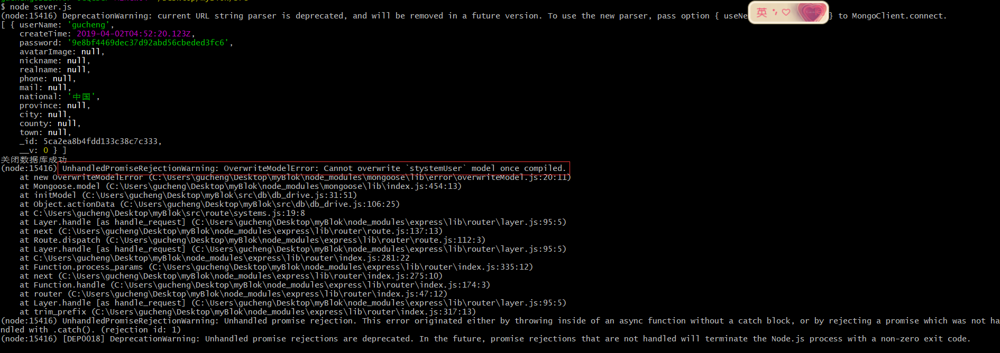
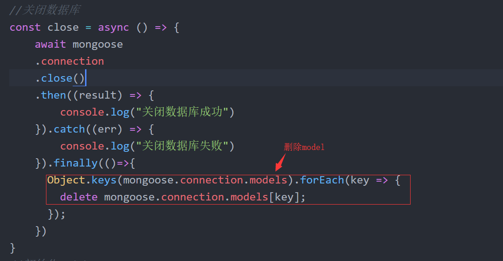

mongoose 初步数据库连接（可能存在bug）
=======

用法
----
const db = require('./db/db_drive');

db.actionData(options, callback)


mongodb配置
---
在DBsettins.js配置，具体配置参考mongoose官网

callback 说明
---
返回一个result参数


options 说明
----
* options.collection 必填 “集合名称”, 值具体如：’user‘

* options.model 必填 “数据模型”，值具体如下：
```
const Schema = require('mongoose').Schema;

const USER = Schema(
    {
        name: 'string',
        createTime: {
            type: Date,
            default: Date.now()
        },
        age: {
            type: Number,
            default: 18
        }
    }
)


module.exports = {
    user: USER
}
```

* options.data 必填 “数据或者条件”，数据类型是一维数组对象，具体参考options.acitonType


* options.acitonType 必填 “操作数据库方法”，默认值：'default' 查看符合查询条件的信息条数,  

>值为：'insert' 向数据库插入数据， options.data为不限制数组长度  
>值为：'delete' 向数据库删除数据， options.data为数组长度1  
>值为：'find' 向数据库查看数据， options.data为数组长度1  
>值为：'update' 向数据库更新数据， options.data为数组长度2 [旧数据对象或者查询条件，新数据对象对象或者更新条件对象]    

options.additional 可填， ’额外条件‘ 是一个对象  
```
options.additional.sort 可填， ’排序条件‘ 是一个对象
options.additional.limit 可填， ’一页显示多少条信息‘ 是一个对象
options.additional.skip 可填， ’忽略信息条数‘ 是一个对象
```


当出现这种问题
====

====
我的解决方案是: 可能不是最佳，欢迎大神指出错点->><2112305445@qq.com>



